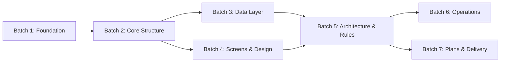

# PREPARATION_PLAN
## CockingApp — Recipe Web Application (Admin Dashboard)

| Metadata | |
|----------|-|
| **Phase** | 3 — Project Preparation Planning |
| **Status** | ✅ Approved v2 |
| **Project Size** | Medium |
| **Client** | Noor (Administrator) |
| **Owner** | Majed |
| **Date** | 2026-06-30 |

---

## 1. Executive Summary

This document defines the complete preparation roadmap for CockingApp — a bilingual (Arabic RTL) web application for recipes with an admin dashboard, built on **Next.js + Prisma + PostgreSQL**.

The preparation phase transforms all approved discovery inputs, technical decisions, design references, and client-approved proposals into **structured, actionable documentation** that will serve as the single source of truth for:
- Implementation (Phase 6)
- Quality assurance and testing
- Client handover and future maintenance

**Total estimated preparation files: 19** across 7 sequential batches (~3 hours total).

---

## 2. Strategic Approach

### 2.1 Preparation Philosophy

- **Traceability**: Every preparation file must trace back to an approved decision in `01_APPLICATION_IDEA.md`, `02_TECHNICAL_CONTEXT.md`, `DESIGN.md`, or the approved `APPLICATION_PROPOSAL.html`.
- **Completeness without bloat**: 19 files is the right size for a medium project. No unnecessary screens, features, or abstractions.
- **Executable output**: Each file is written so that an implementation agent (or Tera in Phase 6) can act on it without re-interpretation.
- **Client-ready**: All files use Arabic-first, professional language suitable for client presentation when needed.

### 2.2 Execution Mode

**Recommended: Direct execution by Tera (Option A)**

Rationale:
- The project scope is well-defined and documented
- All inputs (application idea, technical context, design system, approved proposal) are complete
- Sub-agent delegation for preparation would introduce coordination overhead without proportional benefit
- Tera maintains consistency across all 19 files, reducing contradictions
- Estimated 3 hours of focused work across 7 batches is manageable

**Decision Gate**: If this plan is approved, I will proceed directly to file creation in the defined order.

---

## 3. Preparation File Inventory

### 3.1 Core Files — Always Required

| ID  | File Name                        | Priority     | Purpose                                                                                 | Dependencies |
| --- | -------------------------------- | ------------ | --------------------------------------------------------------------------------------- | ------------ |
| C1  | `PROJECT_RULES.md`               | **Critical** | Captures any project-specific rules from Majed/Noor before any other work               | None         |
| C2  | `00_PROJECT_INPUTS.md`           | **Critical** | Consolidated intake from `01_APPLICATION_IDEA.md` + `02_TECHNICAL_CONTEXT.md`           | C1           |
| C3  | `01_PROJECT_BRIEF.md`            | **Critical** | One-page executive summary for all stakeholders                                         | C2           |
| C4  | `02_SCOPE_AND_BOUNDARIES.md`     | **Critical** | Clear in-scope vs out-of-scope with MVP classification per `MVP_DEFINITION_PROTOCOL.md` | C2           |
| C5  | `03_MODULES_AND_FEATURES.md`     | **Critical** | Full module decomposition with feature-level detail and phase mapping                   | C3, C4       |
| C6  | `04_USERS_ROLES_PERMISSIONS.md`  | **Critical** | User types: Visitor (anonymous) + Admin (Noor). Permission matrix.                      | C5           |
| C7  | `05_BUSINESS_WORKFLOWS.md`       | **Critical** | End-to-end workflows: recipe CRUD, comment moderation, ingredient management            | C5, C6       |
| C8  | `06_DATA_MODEL_PREPARATION.md`   | **Critical** | Entity-relationship overview, field descriptions, validation rules                      | C7           |
| C9  | `07_SCREENS_AND_UI_STRUCTURE.md` | **Critical** | Screen inventory, layout structure, navigation flow, RTL considerations                 | C5, C6       |
| C10 | `08_TECHNICAL_ARCHITECTURE.md`   | **Critical** | Final architecture decisions: folder structure, component tree, data flow               | C2           |
| C11 | `09_IMPLEMENTATION_PLAN.md`      | **Critical** | High-level implementation sequence, task grouping, milestone mapping                    | All above    |
| C12 | `10_TESTING_AND_ACCEPTANCE.md`   | **Critical** | Test strategy, acceptance criteria per module, QA gates                                 | C5, C8       |
| C13 | `11_DELIVERY_AND_HANDOVER.md`    | **Critical** | Deployment checklist, handover documentation requirements                               | C10          |

### 3.2 Conditional Files — Required for This Project

| ID | File Name | Need Level | Justification |
|----|-----------|------------|---------------|
| D1 | `12_BUSINESS_RULES.md` | **Required** | Complex rules: comment pre-moderation, unique ingredient enforcement, measurement unit standardization |
| D2 | `13_REPORTS_AND_DASHBOARDS.md` | **Required** | Admin Dashboard requires KPIs, recipe statistics, comment activity |
| D3 | `15_SECURITY_AND_ACCESS_CONTROL.md` | **Required** | Admin access control, session management, API route protection |
| D4 | `21_VALIDATION_AND_ERROR_HANDLING.md` | **Required** | Multiple forms (recipe, ingredient, category) with complex validation |
| D5 | `22_DEPLOYMENT_AND_ENVIRONMENTS.md` | **Required** | On-premise deployment documented for client's server team |
| D6 | `35_ROADMAP_AND_FUTURE_PHASES.md` | **Required** | Client-approved 6-phase roadmap must be formalized |

### 3.3 Supporting Files

| ID | File Name | Need Level | Justification |
|----|-----------|------------|---------------|
| S1 | `19_DATABASE_DESIGN.md` | **Required** | Prisma schema design, migration strategy, indexing plan |
| S2 | `28_UI_UX_GUIDELINES.md` | **Required** | Claude design system from `getdesign.md`: colors, typography, spacing, components |
| S3 | `18_IMPORT_EXPORT_DATA.md` | Medium | PDF recipe export, potential bulk import of ingredients |
| S4 | `23_BACKUP_AND_RECOVERY.md` | Medium | Production backup strategy for on-premise |
| S5 | `20_API_CONTRACTS.md` | Low-Medium | API route contracts (can be embedded in `07_SCREENS_AND_UI_STRUCTURE.md`) |
| S6 | `14_INTEGRATIONS_AND_EXTERNAL_SERVICES.md` | Low | YouTube embed only — minimal documentation needed |
| S7 | `16_AUDIT_LOG_AND_ACTIVITY_TRACKING.md` | Low | Single admin — activity tracked via database timestamps |
| S8 | `17_NOTIFICATIONS_AND_ALERTS.md` | Low | No notification system in current scope |
| S9 | `24_CLIENT_REVIEW_NOTES.md` | Low | Can be merged with `ISSUES_AND_GAPS.md` |
| S10 | `25_CHANGE_REQUESTS.md` | Low | Activate only when scope change is requested |

### 3.4 Not Required Files (Explicitly Excluded)

These files were considered and intentionally excluded to prevent bloat:

| File Name | Reason for Exclusion |
|-----------|---------------------|
| `14_INTEGRATIONS_AND_EXTERNAL_SERVICES.md` | YouTube embed only — documented inline in screen specs |
| `16_AUDIT_LOG_AND_ACTIVITY_TRACKING.md` | Single admin — activity tracking via DB timestamps is sufficient |
| `17_NOTIFICATIONS_AND_ALERTS.md` | No notification system in current or planned scope |
| `20_API_CONTRACTS.md` | API contracts embedded in `07_SCREENS_AND_UI_STRUCTURE.md` instead |
| `24_CLIENT_REVIEW_NOTES.md` | Merged into `ISSUES_AND_GAPS.md` for single-point tracking |
| `25_CHANGE_REQUESTS.md` | Created only when a scope change request is formally triggered |
| `26_DEPLOYMENT_DIAGRAMS.md` | Network/comms diagrams deferred to implementation phase |
| `27_PERFORMANCE_BUDGET.md` | Not a performance-critical application; addressed in architecture |
| `29_ACCESSIBILITY_GUIDELINES.md` | Basic accessibility covered in `28_UI_UX_GUIDELINES.md` |
| `30_LOCALIZATION.md` | Arabic-only (RTL) — no multi-language requirement |
| `31_CACHING_STRATEGY.md` | Deferred to implementation if performance requires it |
| `32_SEO_STRATEGY.md` | Public recipes — deferred to Phase 2 or later |
| `33_ANALYTICS_AND_MONITORING.md` | On-premise — addressed in deployment doc at high level |
| `34_ERROR_MONITORING.md` | Deferred to implementation phase |

**Principle**: If a file's content fits clearly within an existing approved file, no separate file is created.

### 3.5 Summary

| Category | Count | Files |
|----------|-------|-------|
| Core (C1–C13) | 13 | Always created |
| Conditional Required (D1–D6) | 6 | Essential for this project |
| Supporting Required (S1–S2) | 2 | Necessary given design system + Prisma |
| Supporting Medium (S3–S5) | 3 | Important but can be deferred |
| Supporting Low (S6–S10) | 5 | Deferred until triggered |
| **Not Required (explicitly excluded)** | **14** | Deliberately excluded to prevent bloat |
| **Active Total (this phase)** | **19** | Created in Phase 3 |
| **Deferred Total** | **8** | S3–S5 + S6–S10, created only when triggered |

---

## 4. Execution Plan

### 4.1 Batch Sequence & Dependencies

| Batch | Phase | Files | Est. Time | Focus |
|-------|-------|-------|-----------|-------|
| **1** | Foundation | C1, C2, C3, C4 | 35 min | Rules, consolidated inputs, brief, scope |
| **2** | Core Structure | C5, C6, C7 | 30 min | Modules, roles, workflows |
| **3** | Data Layer | C8, S1 | 35 min | Data model, database schema |
| **4** | Screen & Design | C9, S2 | 35 min | Screens, UI guidelines (Claude design) |
| **5** | Architecture & Rules | C10, D1, D3, D4 | 30 min | Technical architecture, business rules, security, validation |
| **6** | Operations | D2, D5, S3 | 25 min | Reports, deployment, export |
| **7** | Plans & Delivery | C11, C12, C13, D6 | 30 min | Implementation plan, testing, handover, roadmap |

### 4.2 File Creation Standards

Each preparation file must include:

| Section | Required? | Description |
|---------|-----------|-------------|
| Header block | ✅ | File name, phase reference, version, date, author |
| Purpose | ✅ | Why this file exists |
| Content body | ✅ | The substantive content |
| Dependencies | ✅ | What files or decisions this relies on |
| Open decisions | ✅ | Any unresolved items needing user/client input |
| Approval status | ✅ | Draft / Reviewed / Approved / Superseded |

### 4.3 Quality Gates

Each batch must pass these checks before proceeding to the next:

- [ ] **Consistency Check**: All facts match across files in the batch
- [ ] **Traceability Check**: Every statement traces to an approved input
- [ ] **Arabic Language Review**: Professional, natural Arabic (no machine-translation artifacts)
- [ ] **Cross-batch Alignment**: New batch files align with already-created files

---

## 5. Risk Assessment

| Risk | Likelihood | Impact | Mitigation |
|------|-----------|--------|------------|
| Scope creep during preparation | Low | Medium | Strict adherence to approved scope; flag new items in `ISSUES_AND_GAPS.md` |
| Missing technical detail for on-premise deployment | Medium | High | Defer to implementation phase; note as open decision |
| Design gaps in Claude design system | Low | Medium | Document gaps in `28_UI_UX_GUIDELINES.md` as `Design Gaps` |
| Client changing requirements mid-preparation | Low | High | Freeze current batch; record change request; adjust plan after approval |
| Inconsistency across 19 files | Medium | Medium | Cross-batch alignment quality gate; Tera reviews all files before Phase 4 |

---

## 6. Success Criteria

This preparation phase is complete when:

1. ✅ All **19 active files** are created with **Draft** status
2. ✅ Each file passes its batch quality gate
3. ✅ No **Critical** open issues remain in `ISSUES_AND_GAPS.md`
4. ✅ All files are cross-referenced (no contradictions)
5. ✅ Majed has reviewed the `PROJECT_RULES.md` (if applicable)
6. ✅ The project is ready for **Phase 4 / Phase 5 — Execution Planning**

---

## 7. Approval

| Role | Status | Date |
|------|--------|------|
| **Prepared by** | Tera Agent ✅ | 2026-06-30 |
| **Reviewed by** | Tera Agent ✅ | 2026-06-30 |
| **Approved by** | Majed ✅ (with condition: Phase 4 formal entry via AGENT_DELEGATION_PLAN.md) | 2026-06-30 |

---

## Appendix A: File Content Summary

| File | Key Content |
|------|-------------|
| `PROJECT_RULES.md` | Shared rules between user and Tera |
| `00_PROJECT_INPUTS.md` | Consolidated intake from Phase 1 |
| `01_PROJECT_BRIEF.md` | Executive summary for stakeholders |
| `02_SCOPE_AND_BOUNDARIES.md` | In-scope vs out-of-scope, MVP classification |
| `03_MODULES_AND_FEATURES.md` | Module tree with feature-level detail |
| `04_USERS_ROLES_PERMISSIONS.md` | Visitor + Admin roles, permission matrix |
| `05_BUSINESS_WORKFLOWS.md` | CRUD workflows, comment flow, ingredient management |
| `06_DATA_MODEL_PREPARATION.md` | Entity definitions, relationships, field specs |
| `07_SCREENS_AND_UI_STRUCTURE.md` | Screen inventory, navigation, layout, API contracts |
| `08_TECHNICAL_ARCHITECTURE.md` | Folder structure, component tree, data flow |
| `09_IMPLEMENTATION_PLAN.md` | Task grouping, milestones, dependencies |
| `10_TESTING_AND_ACCEPTANCE.md` | Test strategy, QA gates per module |
| `11_DELIVERY_AND_HANDOVER.md` | Deployment, handover docs, support plan |
| `12_BUSINESS_RULES.md` | Comment moderation, measurement standards, unique ingredients |
| `13_REPORTS_AND_DASHBOARDS.md` | Admin KPIs, charts, data tables |
| `15_SECURITY_AND_ACCESS_CONTROL.md` | Authentication, session, route protection |
| `19_DATABASE_DESIGN.md` | Prisma schema, indexes, migrations |
| `21_VALIDATION_AND_ERROR_HANDLING.md` | Form validation rules, error states, edge cases |
| `22_DEPLOYMENT_AND_ENVIRONMENTS.md` | On-premise setup, environment config |
| `28_UI_UX_GUIDELINES.md` | Claude design system colors, components, spacing |
| `35_ROADMAP_AND_FUTURE_PHASES.md` | 6-phase roadmap, version planning |

## Appendix B: Change Log

| Version | Date | Author | Changes |
|---------|------|--------|---------|
| v1 | 2026-06-30 | Tera | Initial draft |
| v2 | 2026-06-30 | Tera | Full restructuring: strategic approach, quality gates, risk assessment, success criteria, traceability matrix, 3-tier file classification, cross-batch alignment |
